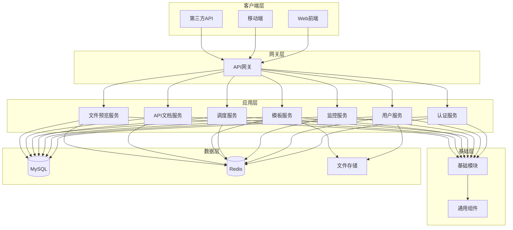

# Rainbow Backend 企业级后端系统

<div align="center">


**基于 Spring Boot 2.7.12 的企业级后端系统**

[项目介绍](#项目介绍) • [技术架构](#技术架构) • [项目结构](#项目结构) • [快速开始](#快速开始) • [文档中心](#文档中心)

</div>

---

## 📋 项目介绍

Rainbow Backend 是一个基于 Spring Boot 2.7.12 构建的企业级后端系统，采用模块化架构设计，提供完整的用户管理、系统监控、任务调度、模板管理和 API 文档功能。系统具有高安全性、高可用性和强扩展性，适用于中大型企业级应用。

### 🎯 核心特性

- 🔐 **安全认证**: 基于 JWT 的无状态认证，支持多端登录
- 🛡️ **权限管理**: 基于 RBAC 模型的细粒度权限控制
- 📊 **系统监控**: 实时监控系统性能、用户行为和安全事件
- ⏰ **任务调度**: 基于 Quartz 的分布式任务调度
- 📝 **操作日志**: 完整的操作审计和日志记录
- 🎨 **模板管理**: 灵活的系统模板和配置管理
- 📚 **API 文档**: 基于 Swagger 的自动文档生成
- 🔄 **数据管理**: 支持数据同步、迁移和备份功能
- 📄 **文件预览**: 集成 kkFileView 支持多种文件格式在线预览

## 🏗️ 技术架构

### 技术栈

| 技术                | 版本      | 说明           |
| ------------------- | --------- | -------------- |
| **Spring Boot**     | 2.7.12    | 应用框架       |
| **Spring Security** | 5.7.7     | 安全框架       |
| **Spring Data JPA** | 2.7.12    | 数据访问       |
| **MySQL**           | 8.3.0     | 主数据库       |
| **Redis**           | 6.x       | 缓存数据库     |
| **JWT**             | 0.9.1     | 令牌认证       |
| **Quartz**          | 2.7.12    | 任务调度       |
| **Swagger**         | 2.2.30    | API 文档       |
| **Lombok**          | 1.18.12   | 代码简化       |
| **Hutool**          | 5.8.32    | 工具库         |
| **FreeMarker**      | 2.3.32    | 模板引擎       |

### 架构设计



## 📁 项目结构

```
rainbow-backend/
├── rainbow-base/                    # 基础工具包模块
│   ├── src/main/java/com/rainbow/base/
│   │   ├── annotation/             # 自定义注解
│   │   │   ├── AppDesc.java       # 应用描述注解
│   │   │   ├── ExcelCell.java     # Excel单元格注解
│   │   │   ├── JobTask.java       # 任务注解
│   │   │   ├── NoRepeatSubmit.java # 防重复提交注解
│   │   │   ├── OperLog.java       # 操作日志注解
│   │   │   ├── RestResponse.java  # 响应注解
│   │   │   └── Search.java        # 搜索注解
│   │   ├── aspect/                 # AOP切面
│   │   │   ├── JobTaskAspect.java # 任务切面
│   │   │   ├── OperLogAspect.java # 操作日志切面
│   │   │   └── RestResponseAspect.java # 响应切面
│   │   ├── config/                 # 配置类
│   │   │   ├── CorsConfig.java    # 跨域配置
│   │   │   ├── JwtConfig.java     # JWT配置
│   │   │   ├── SecurityConfig.java # 安全配置
│   │   │   └── WebMvcConfig.java  # MVC配置
│   │   ├── controller/             # 基础控制器
│   │   │   └── BaseController.java # 基础控制器
│   │   ├── entity/                 # 基础实体
│   │   │   └── BaseEntity.java    # 基础实体类
│   │   ├── exception/              # 异常处理
│   │   │   ├── AuthException.java # 认证异常
│   │   │   ├── BizException.java  # 业务异常
│   │   │   └── DataException.java # 数据异常
│   │   ├── filter/                 # 过滤器
│   │   │   ├── SqlInjectionFilter.java # SQL注入过滤
│   │   │   └── XssFilter.java     # XSS过滤
│   │   ├── interceptor/            # 拦截器
│   │   │   ├── AuthLogInterceptor.java # 认证日志拦截器
│   │   │   └── NoRepeatSubmitInterceptor.java # 防重复提交拦截器
│   │   ├── model/                  # 数据模型
│   │   │   ├── base/              # 基础模型
│   │   │   ├── domain/            # 领域模型
│   │   │   └── vo/                # 视图对象
│   │   ├── repository/             # 基础数据访问
│   │   │   └── BaseRepository.java # 基础仓库接口
│   │   ├── resource/               # 资源层
│   │   │   └── BaseDao.java       # 基础DAO
│   │   ├── service/                # 基础服务
│   │   │   ├── BaseService.java   # 基础服务接口
│   │   │   └── RedisService.java  # Redis服务
│   │   └── utils/                  # 工具类
│   │       ├── JwtTokenUtil.java  # JWT工具
│   │       ├── StringUtils.java   # 字符串工具
│   │       └── DateTools.java     # 日期工具
│   └── pom.xml
├── rainbow-server/                  # 服务端模块
│   ├── rainbow-system/             # 系统核心模块
│   │   ├── src/main/java/com/rainbow/
│   │   │   ├── user/               # 用户管理模块
│   │   │   │   ├── controller/    # 用户控制器
│   │   │   │   ├── entity/        # 用户实体
│   │   │   │   ├── service/       # 用户服务
│   │   │   │   └── repository/    # 用户数据访问
│   │   │   ├── system/             # 系统管理模块
│   │   │   │   ├── controller/    # 系统控制器
│   │   │   │   ├── entity/        # 系统实体
│   │   │   │   ├── service/       # 系统服务
│   │   │   │   └── repository/    # 系统数据访问
│   │   │   ├── monitor/            # 系统监控模块
│   │   │   │   ├── controller/    # 监控控制器
│   │   │   │   ├── entity/        # 监控实体
│   │   │   │   ├── service/       # 监控服务
│   │   │   │   └── repository/    # 监控数据访问
│   │   │   ├── scheduler/          # 任务调度模块
│   │   │   │   ├── controller/    # 调度控制器
│   │   │   │   ├── entity/        # 调度实体
│   │   │   │   ├── service/       # 调度服务
│   │   │   │   └── job/           # 任务实现
│   │   │   ├── template/           # 模板管理模块
│   │   │   │   ├── controller/    # 模板控制器
│   │   │   │   ├── entity/        # 模板实体
│   │   │   │   └── service/       # 模板服务
│   │   │   ├── appdoc/             # API文档模块
│   │   │   ├── fileview/           # 文件预览模块
│   │   │   │   ├── controller/    # 文档控制器
│   │   │   │   ├── entity/        # 文档实体
│   │   │   │   └── service/       # 文档服务
│   │   │   ├── config/             # 系统配置
│   │   │   ├── aspect/             # 系统切面
│   │   │   ├── constant/           # 系统常量
│   │   │   └── SystemApplication.java # 主启动类
│   │   ├── src/main/resources/     # 配置文件
│   │   │   ├── application.yml    # 主配置文件
│   │   │   ├── application-dev.yml # 开发环境配置
│   │   │   └── application-prod.yml # 生产环境配置
│   │   └── pom.xml
│   └── pom.xml
├── document/                        # 📚 项目文档中心
│   ├── README.md                   # 文档目录说明
│   ├── PROJECT_SUMMARY.md          # 项目技术总结
│   ├── DEVELOPMENT_GUIDE.md        # 详细开发指南
│   └── QUICK_START.md             # 快速开始指南
├── docker/                          # 🐳 Docker 部署目录
│   ├── README.md                   # Docker 说明文档
│   ├── Dockerfile                  # 应用镜像构建文件
│   ├── docker-compose.yml          # 服务编排配置
│   ├── scripts/                    # 部署脚本
│   │   ├── docker-deploy.sh       # Linux/macOS 部署脚本
│   │   └── docker-deploy.bat      # Windows 部署脚本
│   ├── docs/                       # 部署文档
│   │   └── DOCKER_DEPLOY.md       # Docker 部署指南
│   ├── config/                     # 应用配置
│   ├── mysql/                      # MySQL 配置
│   ├── redis/                      # Redis 配置
│   └── nginx/                      # Nginx 配置
├── pom.xml                          # 根 POM
├── README.md                        # 📚 文档索引中心
└── README_CN.md                     # 🏠 项目主页（中文版）
```

### 模块说明

#### 🎯 rainbow-base (基础模块)

- **职责**: 提供项目的基础组件和通用功能
- **主要功能**:
  - 基础实体类 (BaseEntity)
  - 通用控制器 (BaseController)
  - 通用服务接口 (BaseService)
  - 通用数据访问 (BaseRepository)
  - 注解定义 (@NoRepeatSubmit, @OperLog, @RestResponse)
  - 异常处理 (BaseException, BizException, DataException)
  - 工具类 (JwtTokenUtil, StringUtils 等)
  - 配置类 (JwtConfig, CorsConfig 等)
  - 拦截器和过滤器
  - 常量定义

#### 🚀 rainbow-system (系统核心模块)

- **职责**: 提供系统核心业务功能
- **主要功能**:
  - **用户管理**: 用户注册、登录、信息管理、权限控制
  - **系统管理**: 系统配置、菜单管理、角色管理
  - **系统监控**: CPU、内存、磁盘、JVM 监控
  - **任务调度**: 基于 Quartz 的定时任务管理
  - **模板管理**: 系统模板和配置管理
  - **API文档**: 接口文档管理和生成
  - **文件预览**: 基于 kkFileView 的多格式文件在线预览

## 🚀 快速开始

### 环境要求

- **JDK**: 1.8 或更高版本
- **Maven**: 3.6 或更高版本
- **MySQL**: 8.0 或更高版本
- **Redis**: 6.0 或更高版本
- **IDE**: 推荐使用 IntelliJ IDEA 或 Cursor IDE

### 🐳 Docker 部署（推荐）

如果您想快速体验系统，推荐使用 Docker 部署：

```bash
# 克隆项目
git clone https://github.com/junsheng100/rainbow-backend.git
cd rainbow-backend

# 进入 Docker 目录
cd docker

# 一键部署（Linux/macOS）
./scripts/docker-deploy.sh

# 一键部署（Windows）
scripts\docker-deploy.bat
```

部署成功后访问：
- 🌐 **应用地址**: http://localhost:8080
- 📚 **API文档**: http://localhost:8080/swagger-ui.html

详细说明请参考：[Docker 部署指南](docker/docs/DOCKER_DEPLOY.md)

更多部署相关文档请查看：[📚 文档中心](#文档中心)

### 🔧 传统安装步骤

如果您需要了解详细的安装和配置过程，请参考：[开发指南](document/DEVELOPMENT_GUIDE.md)

#### 1. **克隆项目**

```bash
git clone https://github.com/junsheng100/rainbow-backend.git
cd rainbow-backend
```

#### 2. **配置数据库**

```sql
-- 创建数据库
CREATE DATABASE db_rainbow CHARACTER SET utf8mb4 COLLATE utf8mb4_unicode_ci;

-- 创建用户（可选）
CREATE USER 'rainbow'@'%' IDENTIFIED BY 'your_password';
GRANT ALL PRIVILEGES ON db_rainbow.* TO 'rainbow'@'%';
FLUSH PRIVILEGES;
```

#### 3. **配置应用**

```yaml
# application-dev.yml
spring:
  datasource:
    url: jdbc:mysql://localhost:3306/db_rainbow?useUnicode=true&characterEncoding=utf8&serverTimezone=Asia/Shanghai
    username: root
    password: your_password
  redis:
    host: localhost
    port: 6379
    password: your_redis_password
    database: 0
```

#### 4. **启动应用**

```bash
# 编译项目
mvn clean install

# 启动应用
mvn spring-boot:run -pl rainbow-server/rainbow-system
```

#### 5. **访问应用**

- **应用地址**: http://localhost:8080
- **API文档**: http://localhost:8080/swagger-ui.html

## 📚 文档中心

Rainbow Backend 提供了完整的文档体系，帮助不同角色的用户快速上手和使用系统。

> 📖 **文档索引**: [README_INDEX.md](README_INDEX.md) - 快速找到所需文档

### 📖 文档导航

- **[项目技术总结](document/PROJECT_SUMMARY.md)** - 技术架构、核心模块分析、技术特色
- **[开发指南](document/DEVELOPMENT_GUIDE.md)** - 开发规范、安全开发、性能优化、测试指南
- **[快速开始指南](document/QUICK_START.md)** - 5分钟快速启动、环境检查、核心功能体验
- **[Docker 部署指南](docker/docs/DOCKER_DEPLOY.md)** - 完整的容器化部署说明

### 🎯 按角色选择文档

- **新用户**: 从 [快速开始指南](document/QUICK_START.md) 开始
- **开发者**: 重点阅读 [开发指南](document/DEVELOPMENT_GUIDE.md)
- **架构师**: 查看 [项目技术总结](document/PROJECT_SUMMARY.md)
- **运维人员**: 参考 [Docker 部署指南](docker/docs/DOCKER_DEPLOY.md)

---

## 📚 开发指南

### 代码规范

#### 1. **命名规范**

```java
// 类名：大驼峰命名
public class UserInfoController extends BaseController<UserInfo, String, UserInfoService> {
  
    // 方法名：小驼峰命名
    public Result<UserInfo> getUserInfo(String userId) {
        // 变量名：小驼峰命名
        UserInfo userInfo = userService.get(userId);
        return Result.success(userInfo);
    }
  
    // 常量：全大写+下划线
    private static final String USER_CACHE_KEY = "user:info:";
}
```

#### 2. **注释规范**

```java
/**
 * 用户信息控制器
 * 
 * @author your-name
 * @since 1.0.0
 */
@RestController
@RequestMapping("/user")
@Tag(name = "用户管理")
public class UserInfoController extends BaseController<UserInfo, String, UserInfoService> {
  
    /**
     * 获取用户信息
     * 
     * @param userId 用户ID
     * @return 用户信息
     */
    @GetMapping("/{userId}")
    @OperLog("获取用户信息")
    public Result<UserInfo> getUserInfo(@PathVariable String userId) {
        return Result.success(service.get(userId));
    }
}
```

#### 3. **异常处理**

```java
try {
    // 业务逻辑
    UserInfo userInfo = userService.get(userId);
    return Result.success(userInfo);
} catch (BizException e) {
    log.error("获取用户信息失败，用户ID: {}", userId, e);
    return Result.error(e.getCode(), e.getMessage());
} catch (Exception e) {
    log.error("系统异常，用户ID: {}", userId, e);
    return Result.error(HttpCode.INTERNAL_SERVER_ERROR, "系统异常");
}
```

### 安全规范

#### 1. **认证授权**

```java
// 使用 @PreAuthorize 进行权限控制
@PreAuthorize("hasRole('ADMIN')")
@GetMapping("/admin/users")
public Result<List<UserInfo>> getAllUsers() {
    return Result.success(userService.findAll());
}

// 使用 @NoRepeatSubmit 防止重复提交
@NoRepeatSubmit(interval = 5, timeUnit = TimeUnit.SECONDS)
@PostMapping("/create")
public Result<UserInfo> createUser(@RequestBody @Valid UserInfo userInfo) {
    return Result.success(userService.store(userInfo));
}
```

#### 2. **数据验证**

```java
// 使用 @Valid 进行参数验证
@PostMapping("/update")
public Result<UserInfo> updateUser(@RequestBody @Valid UserInfo userInfo) {
    return Result.success(userService.store(userInfo));
}

// 实体类验证注解
@Entity
@Table(name = "user_info")
public class UserInfo extends BaseEntity {
  
    @NotBlank(message = "用户名不能为空")
    @Size(min = 3, max = 20, message = "用户名长度必须在3-20之间")
    @Column(unique = true)
    private String userName;
  
    @NotBlank(message = "密码不能为空")
    @Size(min = 6, message = "密码长度不能少于6位")
    private String password;
}
```

### 性能优化

#### 1. **数据库优化**

```java
// 使用分页查询避免大量数据查询
@PostMapping("/page")
public Result<PageData<UserInfo>> getUserPage(@RequestBody BaseVo<UserInfo> vo) {
    return Result.success(service.page(vo));
}

// 使用批量操作提高性能
@PostMapping("/batch/delete")
public Result<Boolean> deleteUsers(@RequestBody CommonVo<List<String>> vo) {
    return Result.success(service.deleteInBatch(vo.getData()));
}
```

#### 2. **缓存策略**

```java
// 使用 Redis 缓存热点数据
@Service
public class UserInfoServiceImpl extends BaseServiceImpl<UserInfo, String, UserInfoDao> {
  
    @Autowired
    private RedisTemplate<String, Object> redisTemplate;
  
    @Override
    public UserInfo get(String id) {
        // 先从缓存获取
        String cacheKey = "user:info:" + id;
        UserInfo userInfo = (UserInfo) redisTemplate.opsForValue().get(cacheKey);
      
        if (userInfo == null) {
            // 缓存未命中，从数据库获取
            userInfo = super.get(id);
            if (userInfo != null) {
                // 设置缓存，过期时间30分钟
                redisTemplate.opsForValue().set(cacheKey, userInfo, 30, TimeUnit.MINUTES);
            }
        }
      
        return userInfo;
    }
}
```

## 🔧 部署指南

### Docker 部署（推荐）

Rainbow Backend 提供了完整的 Docker 部署支持，包括一键部署脚本和详细的配置说明。

#### 🚀 快速部署

```bash
# 进入 Docker 目录
cd docker

# 一键部署（Linux/macOS）
./scripts/docker-deploy.sh

# 一键部署（Windows）
scripts\docker-deploy.bat

# 手动部署
docker-compose up -d
```

#### 📁 Docker 目录结构

```
docker/
├── README.md                    # Docker 说明文档
├── Dockerfile                   # 应用镜像构建文件
├── docker-compose.yml           # 服务编排配置
├── scripts/                     # 部署脚本
├── docs/                        # 部署文档
├── config/                      # 应用配置
├── mysql/                       # MySQL 配置
├── redis/                       # Redis 配置
└── nginx/                       # Nginx 配置
```

#### 🔧 详细配置

- **Docker 部署指南**: [docker/docs/DOCKER_DEPLOY.md](docker/docs/DOCKER_DEPLOY.md)
- **Docker 目录说明**: [docker/README.md](docker/README.md)

### 传统部署

#### 1. **构建镜像**

```dockerfile
# Dockerfile
FROM openjdk:8-jre-alpine
VOLUME /tmp
COPY target/rainbow-system.jar app.jar
ENTRYPOINT ["java","-jar","/app.jar"]
```

#### 2. **Docker Compose**

```yaml
# docker-compose.yml
version: '3.8'
services:
  rainbow-system:
    build: .
    ports:
      - "8080:8080"
    environment:
      - SPRING_PROFILES_ACTIVE=prod
    depends_on:
      - mysql
      - redis
  
  mysql:
    image: mysql:8.0
    environment:
      MYSQL_ROOT_PASSWORD: root
      MYSQL_DATABASE: db_rainbow
    ports:
      - "3306:3306"
    volumes:
      - mysql_data:/var/lib/mysql
  
  redis:
    image: redis:6-alpine
    ports:
      - "6379:6379"
    volumes:
      - redis_data:/data

volumes:
  mysql_data:
  redis_data:
```

### 生产环境配置

#### 1. **JVM 参数优化**

```bash
java -Xms2g -Xmx4g -XX:+UseG1GC -XX:MaxGCPauseMillis=200 \
     -Dspring.profiles.active=prod \
     -jar rainbow-system.jar
```

#### 2. **数据库连接池配置**

```yaml
spring:
  datasource:
    hikari:
      maximum-pool-size: 20
      minimum-idle: 5
      connection-timeout: 30000
      idle-timeout: 600000
      max-lifetime: 1800000
```

## 📊 监控和运维

### 系统监控

#### 1. **性能监控**

- CPU 使用率监控
- 内存使用情况监控
- JVM 堆内存监控
- 数据库连接池监控

#### 2. **业务监控**

- 用户登录统计
- 接口调用频率
- 异常情况统计
- 系统响应时间

#### 3. **安全监控**

- 登录失败次数
- 异常访问检测
- 敏感操作记录
- 权限变更审计

### 日志管理

#### 1. **日志配置**

```xml
<!-- logback-spring.xml -->
<configuration>
    <appender name="FILE" class="ch.qos.logback.core.rolling.RollingFileAppender">
        <file>logs/rainbow-system.log</file>
        <rollingPolicy class="ch.qos.logback.core.rolling.TimeBasedRollingPolicy">
            <fileNamePattern>logs/rainbow-system.%d{yyyy-MM-dd}.log</fileNamePattern>
            <maxHistory>30</maxHistory>
        </rollingPolicy>
    </appender>
</configuration>
```

#### 2. **日志级别**

- **ERROR**: 系统错误和异常
- **WARN**: 警告信息
- **INFO**: 一般信息
- **DEBUG**: 调试信息

## 🌟 技术特色

### 🔧 架构特色

#### 1. **分层架构设计**

- **四层架构**: Controller → Service → Dao → Repository
- **职责分离**: 每层职责明确，便于维护和测试
- **模板方法模式**: 通过基类提供通用功能，减少重复代码
- **依赖注入**: 使用 Spring IoC 容器管理对象生命周期

#### 2. **安全防护体系**

- **多层安全防护**: JWT + Spring Security + 自定义过滤器
- **XSS 防护**: 输入输出过滤和转义
- **SQL 注入防护**: 参数化查询和 SQL 注入检测
- **重复提交防护**: 基于 Redis 的防重复提交机制
- **操作日志审计**: 完整的操作记录和审计追踪

#### 3. **性能优化策略**

- **缓存机制**: Redis 缓存热点数据，提升响应速度
- **连接池优化**: 数据库连接池和线程池配置优化
- **分页查询**: 避免大量数据查询，提升查询效率
- **批量操作**: 支持批量插入、更新、删除操作

#### 4. **扩展性设计**

- **模块化架构**: 模块化设计，支持独立部署和扩展
- **插件化设计**: 支持功能模块的插件化扩展
- **配置外化**: 支持配置中心集成，动态配置更新
- **多租户支持**: 预留多租户架构支持

### 🎯 业务特色

#### 1. **智能任务调度**

- **Quartz 集成**: 基于 Quartz 的分布式任务调度
- **动态任务管理**: 支持任务的动态创建、修改、删除
- **任务监控**: 实时监控任务执行状态和结果
- **失败重试**: 支持任务失败自动重试机制

#### 2. **系统监控中心**

- **实时监控**: CPU、内存、磁盘、JVM 实时监控
- **性能分析**: 系统性能指标分析和趋势预测
- **告警机制**: 异常情况自动告警和通知
- **可视化展示**: 监控数据的可视化图表展示

#### 3. **API 文档管理**

- **自动生成**: 基于 Swagger 的 API 文档自动生成
- **在线调试**: 支持 API 在线调试和测试
- **版本管理**: API 版本管理和变更追踪
- **权限控制**: API 访问权限控制和管理

#### 5. **文件预览系统**

- **多格式支持**: 基于 [kkFileView](https://github.com/kekingcn/kkFileView) 支持 Office、PDF、图片等多种格式
- **在线预览**: 无需下载，直接在浏览器中预览文件内容
- **格式转换**: 支持文件格式转换和在线查看
- **安全控制**: 文件访问权限控制和预览日志记录

#### 4. **模板管理系统**

- **模板引擎**: 基于 FreeMarker 的模板引擎
- **动态模板**: 支持模板的动态创建和修改
- **模板复用**: 模板的复用和继承机制
- **版本控制**: 模板版本管理和回滚功能

## 🤝 贡献指南

### 开发流程

1. **Fork 项目**
2. **创建特性分支**: `git checkout -b feature/your-feature`
3. **提交更改**: `git commit -am 'Add some feature'`
4. **推送分支**: `git push origin feature/your-feature`
5. **创建 Pull Request**

### 代码审查

- 所有代码必须通过代码审查
- 遵循项目的代码规范
- 添加必要的测试用例
- 更新相关文档

## 📄 许可证

本项目采用 [MIT License](LICENSE) 许可证。

## 📞 联系我们

- **项目地址**: https://github.com/junsheng100/rainbow-backend
- **问题反馈**: https://github.com/junsheng100/rainbow-backend/issues
- **邮箱**: junsheng100@foxmail.com
- **QQ**: 304299340

## 📈 项目总结

### 🎯 项目价值

Rainbow Backend 是一个企业级的、功能完整的后端系统解决方案，具有以下核心价值：

#### 1. **技术先进性**

- 采用最新的 Spring Boot 2.7.12 技术栈
- 完善的微服务架构设计，支持高并发和大规模部署
- 完善的安全防护体系，保障系统安全
- 模块化设计，便于维护和扩展

#### 2. **功能完整性**

- 完整的用户认证和权限管理体系
- 智能的任务调度和系统监控功能
- 灵活的模板管理和 API 文档系统
- 强大的数据管理和同步工具

#### 3. **架构合理性**

- 清晰的分层架构，职责分离明确
- 模块化设计，便于维护和扩展
- 统一的设计模式和开发规范
- 完善的异常处理和日志记录

#### 4. **实用性**

- 开箱即用，快速部署
- 详细的文档和示例代码
- 完善的开发工具和规范
- 活跃的社区支持和更新维护

### 🚀 未来规划

#### 1. **技术升级**

- 升级到 Spring Boot 3.x 和 Java 17
- 支持云原生部署和容器化
- 增强微服务治理能力
- 集成更多现代化技术栈

#### 2. **功能扩展**

- 支持更多认证方式（OAuth2、SAML、LDAP）
- 增强权限管理功能（动态权限、权限继承）
- 完善监控和告警系统
- 增加更多业务模块

#### 3. **性能优化**

- 引入分布式缓存和消息队列
- 优化数据库查询和索引
- 支持读写分离和分库分表
- 增强系统容错和降级能力

#### 4. **生态建设**

- 完善开发文档和教程
- 建立开发者社区
- 提供更多示例和最佳实践
- 支持插件化扩展

### 💡 使用建议

#### 1. **开发团队**

- 严格遵循项目的代码规范和架构设计
- 充分利用项目提供的基类和工具类
- 定期更新依赖版本，保持技术栈的先进性
- 建立完善的测试和部署流程

#### 2. **运维团队**

- 合理配置系统参数，优化性能
- 建立完善的监控和告警机制
- 定期备份数据和配置文件
- 制定应急预案和故障恢复流程

#### 3. **业务团队**

- 根据业务需求合理设计权限模型
- 充分利用系统的监控和日志功能
- 定期进行安全审计和权限清理
- 关注系统性能指标和用户体验

---

<div align="center">

**如果这个项目对你有帮助，请给它一个 ⭐️**

Made with ❤️ by jackson.liu

</div>
