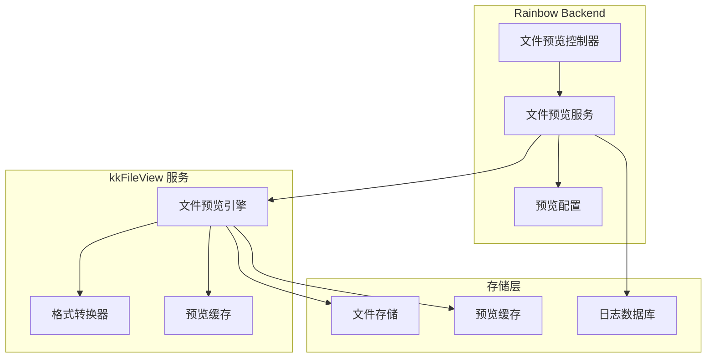

# 文件预览功能说明

## 📄 功能概述

Rainbow Backend 集成了 [kkFileView](https://github.com/kekingcn/kkFileView) 项目，提供强大的文件在线预览功能。用户无需下载文件，即可在浏览器中直接预览多种格式的文档内容。

## 🎯 核心特性

### 1. **多格式支持**
- **Office 文档**: `doc`, `docx`, `xls`, `xlsx`, `ppt`, `pptx`, `csv` 等
- **PDF 文档**: `pdf`, `ofd` 等
- **图片文件**: `jpg`, `png`, `gif`, `bmp`, `webp` 等
- **文本文件**: `txt`, `md`, `java`, `py`, `xml`, `json` 等
- **压缩文件**: `zip`, `rar`, `7z`, `tar.gz` 等
- **CAD 文件**: `dwg`, `dxf` 等
- **其他格式**: `psd`, `eps`, `wmf`, `emf` 等

### 2. **在线预览**
- **无需下载**: 文件直接在浏览器中预览
- **响应式设计**: 支持移动端和桌面端
- **多页浏览**: 支持多页文档的翻页浏览
- **缩放控制**: 支持文档缩放和旋转

### 3. **格式转换**
- **Office 转 PDF**: 将 Office 文档转换为 PDF 格式
- **图片转换**: 支持图片格式转换和压缩
- **文本渲染**: 支持 Markdown、代码等文本格式渲染

### 4. **安全控制**
- **权限验证**: 基于用户权限的文件访问控制
- **预览日志**: 记录文件预览操作日志
- **文件加密**: 支持加密文件的预览
- **访问限制**: 可配置文件访问的 IP 白名单

## 🏗️ 技术架构

### 集成方式



### 核心组件

#### 1. **文件预览控制器 (FilePreviewController)**
- 处理文件预览请求
- 验证用户权限
- 调用预览服务
- 返回预览结果

#### 2. **文件预览服务 (FilePreviewService)**
- 文件格式检测
- 预览策略选择
- 缓存管理
- 日志记录

#### 3. **预览配置管理 (PreviewConfig)**
- 支持的文件格式配置
- 预览参数设置
- 安全策略配置
- 性能优化参数

## 🚀 使用方法

### 1. **基本预览**

```java
@RestController
@RequestMapping("/api/file/preview")
public class FilePreviewController {
    
    @Autowired
    private FilePreviewService filePreviewService;
    
    @GetMapping("/{fileId}")
    public Result<String> previewFile(@PathVariable String fileId) {
        // 获取文件预览链接
        String previewUrl = filePreviewService.getPreviewUrl(fileId);
        return Result.success(previewUrl);
    }
    
    @PostMapping("/upload")
    public Result<String> uploadAndPreview(@RequestParam("file") MultipartFile file) {
        // 上传文件并获取预览链接
        String previewUrl = filePreviewService.uploadAndPreview(file);
        return Result.success(previewUrl);
    }
}
```

### 2. **配置示例**

```yaml
# application.yml
file:
  preview:
    enabled: true
    kkfileview:
      url: http://localhost:8012
      timeout: 30000
      cache-enabled: true
      cache-expire: 3600
    supported-formats:
      office: [doc, docx, xls, xlsx, ppt, pptx]
      pdf: [pdf, ofd]
      image: [jpg, png, gif, bmp, webp]
      text: [txt, md, java, py, xml, json]
      archive: [zip, rar, 7z, tar.gz]
    security:
      enable-auth: true
      allowed-ips: []
      max-file-size: 100MB
```

### 3. **前端集成**

```javascript
// 文件预览组件
const FilePreview = ({ fileId, fileName, fileType }) => {
  const [previewUrl, setPreviewUrl] = useState('');
  
  useEffect(() => {
    // 获取预览链接
    fetch(`/api/file/preview/${fileId}`)
      .then(response => response.json())
      .then(data => {
        if (data.success) {
          setPreviewUrl(data.data);
        }
      });
  }, [fileId]);
  
  return (
    <div className="file-preview">
      <h3>{fileName}</h3>
      {previewUrl && (
        <iframe
          src={previewUrl}
          width="100%"
          height="600px"
          frameBorder="0"
          title="文件预览"
        />
      )}
    </div>
  );
};
```

## 🔧 部署配置

### 1. **Docker 部署**

```yaml
# docker-compose.yml
version: '3.8'
services:
  kkfileview:
    image: keking/kkfileview:latest
    container_name: kkfileview
    ports:
      - "8012:8012"
    environment:
      - KK_CONTEXT_PATH=/
      - KK_OFFICE_PREVIEW_TYPE=libreoffice
      - KK_OFFICE_PREVIEW_MAX_TASKS=20
      - KK_OFFICE_PREVIEW_TASK_QUEUE_TIMEOUT=3000
    volumes:
      - ./kkfileview/config:/opt/kkFileView/config
      - ./kkfileview/logs:/opt/kkFileView/logs
      - ./kkfileview/cache:/opt/kkFileView/cache
    networks:
      - rainbow-network
    restart: unless-stopped
```

### 2. **传统部署**

```bash
# 下载 kkFileView
wget https://github.com/kekingcn/kkFileView/releases/download/4.4.0/kkFileView-4.4.0.tar.gz
tar -xzf kkFileView-4.4.0.tar.gz
cd kkFileView-4.4.0

# 启动服务
./startup.sh
```

## 📊 性能优化

### 1. **缓存策略**
- **预览缓存**: 缓存已转换的预览文件
- **元数据缓存**: 缓存文件元数据信息
- **CDN 加速**: 支持 CDN 分发预览文件

### 2. **并发控制**
- **任务队列**: 控制并发转换任务数量
- **超时设置**: 设置预览超时时间
- **资源限制**: 限制单个文件的大小和处理时间

### 3. **监控指标**
- **预览成功率**: 监控文件预览的成功率
- **响应时间**: 监控预览响应时间
- **错误统计**: 统计预览失败的原因

## 🔒 安全考虑

### 1. **文件安全**
- **文件类型验证**: 验证上传文件的类型和内容
- **大小限制**: 限制文件大小，防止恶意文件
- **病毒扫描**: 集成病毒扫描服务

### 2. **访问控制**
- **用户认证**: 验证用户身份和权限
- **IP 白名单**: 限制访问来源
- **频率限制**: 限制预览请求频率

### 3. **数据保护**
- **文件加密**: 支持文件内容加密
- **临时文件**: 预览完成后自动清理临时文件
- **日志脱敏**: 敏感信息脱敏处理

## 🐛 常见问题

### 1. **预览失败**
- 检查文件格式是否支持
- 确认 kkFileView 服务是否正常运行
- 查看服务日志获取详细错误信息

### 2. **性能问题**
- 调整缓存配置
- 优化文件存储策略
- 增加服务器资源

### 3. **格式支持**
- 查看 kkFileView 的格式支持列表
- 确认文件编码格式
- 检查文件是否损坏

## 📚 相关资源

- **[kkFileView 官方仓库](https://github.com/kekingcn/kkFileView)**
- **[kkFileView 官方文档](https://kkview.cn)**
- **[Docker 镜像](https://hub.docker.com/r/keking/kkfileview)**
- **[在线演示](https://demo.kkview.cn)**

## 🤝 贡献指南

如果您在使用过程中发现问题或有改进建议，欢迎：

1. 提交 Issue 到 [Rainbow Backend](https://github.com/junsheng100/rainbow-backend/issues)
2. 提交 Issue 到 [kkFileView](https://github.com/kekingcn/kkFileView/issues)
3. 提交 Pull Request 贡献代码

---

*文件预览功能基于 [kkFileView](https://github.com/kekingcn/kkFileView) 开源项目，感谢 kekingcn 团队的开源贡献！*
